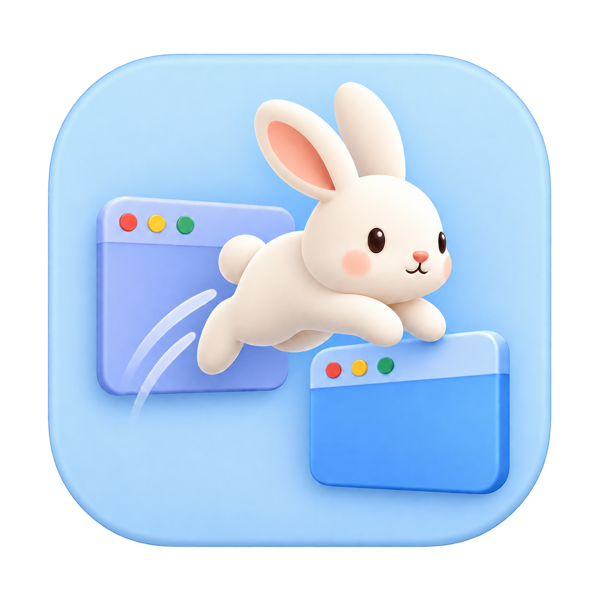

<p align="center">
  
</p>

<h1 align="center">WindowHop</h1>

<p align="center">Fast, compact window switching for macOS. Inspired by <a href="https://contexts.co/">Contexts</a>.</p>

Switch individual windows, search by app or title, and jump to results with number shortcuts or short letter codes. Built with Swift and AppKit, with a compact native interface and no third-party packages.

## Get started

Requires **macOS 13+** and Xcode or Command Line Tools.

```sh
git clone https://github.com/peixian/windowhop.git
cd windowhop
./scripts/build.sh
open dist/WindowHop.app
```

1. Allow WindowHop in **System Settings → Privacy & Security → Accessibility**.
2. Quit Contexts if it is running; WindowHop pauses global shortcuts while Contexts is open.
3. Open WindowHop's menu-bar menu and choose **Enable Keyboard Shortcuts**.

To try the interface without permissions, choose **Preview Sample Windows** from the menu.

## Keyboard controls

| Action | Default shortcut |
| --- | --- |
| Cycle windows | Hold **⌘**, press **Tab**, release **⌘** to switch |
| Cycle backwards | **⌘⇧Tab** |
| Cycle the frontmost app's windows | **Command + backquote** |
| Alternate switcher | **Option-Tab**, enable it in Settings |
| Search while cycling | **⌘S / Option-S**, type, then release the cycling modifier |
| Search | **Control-Space**, type, then **Return** |
| Fast Search | Hold **Right Option**, type, then release |
| Move through results | **↑ / ↓** or **Tab / ⇧Tab** |
| Switch to one of the first nine results | **⌘1–9** while the panel is open |
| Close / minimize the selected window | **⌘W / ⌘M** |
| Hide / quit the selected app | **⌘H / ⌘Q** |
| Cancel | **Esc** |

Choose **Settings…** from the menu, or press **⌘,** while WindowHop is active, to record your own shortcuts. Each mode can be disabled independently. Explicitly recorded shortcuts take priority over built-in actions; a reserved number shortcut displays a letter code instead. Fast Search supports left/right Option, Command, Control, or Fn. Settings persist across launches.

### Letter codes

In Search and Fast Search, windows beyond the first nine show codes such as `e`, `fd`, or `fw`. Type the code **without Command**, then press **Return** or release your Fast Search modifier. Its window becomes the first result.

Codes stay attached to windows as the list reorders, and multiple windows from the same app get distinct codes. Automatic codes may change after restarting WindowHop. Custom queries of up to three characters are learned when you select a result; **Forget Learned Searches** clears them.

## Displays, lists, and Sidebar

The switcher appears on **every display by default**, with the same query and selection. Turn off **Settings → General → Show the switcher on every display** to use only the display under your pointer.

**Window Lists** configures the main switcher, alternate switcher, and Sidebar independently: all or visible Spaces, full-screen windows, and whether hidden/minimized windows stay in normal order, move to the bottom, or disappear. Apps without windows can be included. Right-click a result for window actions or **Exclude Application**; restore excluded apps in General.

Enable the optional **Sidebar** for a compact clickable list on each display. It can filter to that display, group by Space, show available Dock badges, and hide until you reach the screen edge. Swipe right or choose **Hide Temporarily** to dismiss it without disabling it.

While searching within a held cycling gesture, letters remain query text; window actions are available before entering search or through the context menu.

An experimental two-finger trackpad-corner gesture is available in General, off by default. Slide down from a top corner and lift to switch. It uses a private macOS touch interface, needs compatible hardware, and requires physical-device validation. Toggle it off/on after connecting a trackpad.

## Current status

Spaces, full-screen discovery, and Dock badges depend on information macOS exposes and remain best effort. Actions request graceful closure or quit, allowing the target app to show save dialogs. Browser-tab search is [researched](docs/BROWSER-TABS.md) but not implemented. See [Contexts feature coverage and platform boundaries](docs/CONTEXTS-PARITY.md).

**Rebuilding can reset Accessibility access** with the default ad-hoc signature. Use a [persistent signing identity](docs/SIGNING.md) to keep the app's identity stable across builds. Switching identities may require one final approval. Secure Keyboard Entry can also prevent global shortcut capture.

Everything runs locally. No network service, analytics, or Screen Recording permission is needed. Learned searches are stored in macOS preferences; window titles and queries are not logged.

## Development

```sh
swift test
./scripts/test-keyboard.sh
./scripts/test-trackpad.sh
./scripts/test-displays.sh # briefly shows test panels on connected displays
./scripts/benchmark-search.sh
```

Builds use release optimization by default. Set `CONFIGURATION=debug` for a debug build. Signing uses `SIGN_IDENTITY`, then the local `.signing-identity` file, then ad-hoc signing if neither is configured. A configured identity that cannot sign fails the build and preserves the previous app. If your environment blocks SwiftPM's nested sandbox, use `SWIFTPM_DISABLE_SANDBOX=1 ./scripts/build.sh` and `swift test --disable-sandbox`.

- [Validation and performance](docs/VALIDATION.md) — tested behavior, benchmarks, and remaining checks. Core timings do not measure end-to-end switching latency.
- [API research](docs/API-RESEARCH.md) — Accessibility APIs, alternatives, and the isolated private window-ID helper.
- [Product](PRODUCT.md) · [Design](DESIGN.md) · [Icon](docs/ICON.md)
